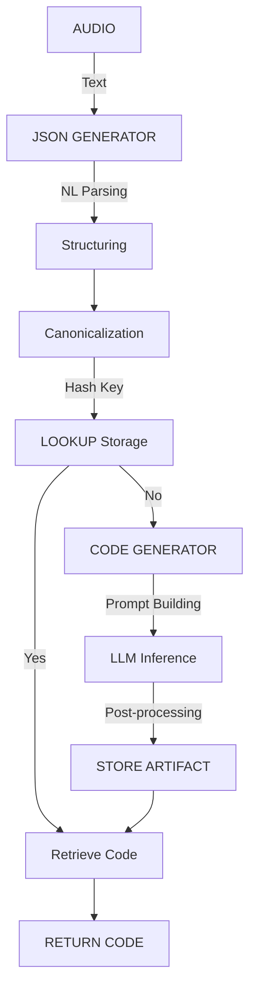

# Project Architecture & Processing Pipeline

This project implements a multi-stage pipeline designed for speech-driven code generation. It utilizes a structured intermediate JSON representation and a lightweight code-only model, followed by a modular hash-key storage & retrieval system. This allows generated functions to be reused or interconnected across sessions.

The entire system operates across four primary levels:

1.  **Audio Processor**
2.  **JSON Generator**
3.  **Code Generator (Lightweight Model)**
4.  **Storage & Retrieval System**

Each level interacts with the next through well-defined interfaces, enabling extensibility, reproducibility, and modularity.

---

## 1. AUDIO PROCESSOR

The Audio Processor is responsible for capturing microphone input, segmenting it, transcribing it using a Whisper-based model, and handing off text to the JSON Generator.

### 1.1 Responsibilities
-   **Capture audio** using Voice Activity Detection (VAD).
-   **Convert audio → text** using Whisper (e.g., tiny model).
-   **Normalize text** (Inverse Text Normalization) to convert spoken numbers to digits.
-   **Stream transcription results** in real-time.
-   **Append session transcripts** to `transcripts.txt`.
-   **Provide clean text output** to the next stage (JSON Generator).

### 1.2 Main Components

#### `main.py`
-   Initializes recorder.
-   Starts continuous transcription loop.
-   Prints live output.
-   Accumulates transcripts.
-   Saves them on termination.

#### `AudioToTextRecorder`
-   Handles:
    -   Microphone input.
    -   VAD (Voice Activity Detection).
    -   Whisper inference.
    -   Inverse Text Normalization (ITN).
    -   Worker threads for audio + transcription.
    -   Streaming text retrieval through queues.

### 1.3 Output
Text such as:
> "the function name would be adjduplicates which would take a string s as input..."

This raw natural-language description is passed to the JSON Generator.

---

## 2. JSON GENERATOR

The JSON Generator converts the natural-language prompt (spoken or typed) into a canonical structured representation that downstream systems can depend on — especially the Code Generator and Storage layer.

**This component is critical because it creates deterministic, parseable metadata that we can hash, reuse, validate, and retrieve later.**

### 2.1 Responsibilities
-   **Parse natural-language specification** into structured JSON.
-   **Canonicalize JSON** for hashing & reproducibility.
-   **Extract**:
    -   Function name
    -   Parameter list
    -   Data structures
    -   Algorithm steps
    -   Language
    -   Notes/constraints
-   **Produce a stable serialized representation**.

### 2.2 Example Output JSON
The following JSON is produced from the NL input:
> "the function name would be adjduplicates which would take a string s as input..."

**Output JSON:**
```json
{
  "intent": "generate_function",
  "language": "java",
  "function": {
    "name": "adjduplicates",
    "visibility": "public static",
    "return_type": "String",
    "params": [
      {"name": "s", "type": "String"}
    ]
  },
  "algorithm": {
    "data_structures": [
      {"type": "stack", "element_type": "char", "var": "st"}
    ],
    "steps": [
      "for each char ch in s.toCharArray()",
      "if !st.isEmpty() and st.peek() == ch then st.pop() else st.push(ch)",
      "create StringBuilder str; for each char c in st append to str",
      "return str.toString()"
    ],
    "notes": "remove adjacent duplicates using char stack"
  },
  "metadata": {
    "source_text": "original speech transcription text..."
  }
}
```

### 2.3 Canonicalization (Critical for Hashing & Reuse)
Before further processing, the JSON is:
1.  **Sorted by key**
2.  **Re-serialized in stable format**
3.  **Hashed via SHA256** to produce a stable key

This enables:
-   Deduplication
-   Exact-match retrieval
-   Deterministic code generation
-   Inter-function connectivity

### 2.4 Subtasks

#### 2.4.1 Natural-Language Parser
Regex + heuristics extract:
-   Function name
-   Parameters
-   Algorithmic steps
-   Core patterns (loops, stack usage, builders)

#### 2.4.2 JSON Normalizer
Ensures deterministic formatting:
-   Sort object keys
-   Collapse whitespace
-   Normalize casing

#### 2.4.3 Hash Generator
```python
key = sha256(canonical_json)
```
This key uniquely identifies the function specification.

---

## 3. CODE GENERATOR (LIGHTWEIGHT MODEL)

This level transforms the canonical JSON into executable code using a **Route 2 architecture: Prompt-Only Lightweight Code Model**.

No fine-tuning required — the model receives structured JSON in the prompt and emits code.

### 3.1 Model Characteristics
-   **Very small** (350M–1B parameters).
-   **Runs locally**, fast inference.
-   **Only responsible for code generation**, not reasoning.
-   **Output can be imperfect**; system will still accept & store it.
-   **Uses stable prompt templates** to reduce hallucination.

**Recommended Models:**
-   Salesforce CodeGen-350M
-   StarCoder-1B

### 3.2 Prompt Template
Example prompt created internally by the system:

```text
INPUT_JSON:
{ ...canonical json... }

INSTRUCTIONS:
Generate only Java code. 
Output a class named Solution with the described function.
No explanations. Code only.
```

**Model output example:**
```java
public class Solution {
    public static String adjduplicates(String s){
        Stack<Character> st=new Stack<>();
        for(char ch:s.toCharArray()){
            if(!st.isEmpty() && st.peek()==ch){
                st.pop();
            }else{
                st.push(ch);
            }
        }
        StringBuilder str=new StringBuilder();
        for(char c:st){
            str.append(c);
        }
        return str.toString();
    }
}
```

### 3.3 Subsections

#### 3.3.1 Prompt Builder
Takes canonical JSON → inserts into template.

#### 3.3.2 Model Runner
Local inference pipeline:
-   Tokenize
-   Forward pass
-   Decode → code

#### 3.3.3 Post-Processor
-   Strip comments if needed.
-   Normalize whitespace.
-   Optionally compile-check syntax.

#### 3.3.4 Multi-Artifact Composition
Models only generate a function at a time. Functions are connected via hash keys in the Storage layer (next section).

---

## 4. STORAGE & RETRIEVAL SYSTEM

This is the most transformative addition made in this iteration.

Instead of generating code fresh every time, the system stores each code artifact as a **reusable module**, keyed by the SHA256 hash of its canonical JSON specification.

The Storage system also supports **function connectivity**, meaning independently-generated functions can be linked into larger programs purely by referencing each other’s hash keys.

### 4.1 Responsibilities
-   **Persist code artifacts**.
-   **Support exact-match retrieval** (via SHA256 keys).
-   **Support human-friendly metadata lookup**.
-   **Connect multiple generated functions** into larger modules.
-   **Provide deterministic recomposition**.
-   **Track versions, usage, dependencies**.

### 4.2 Artifact Format
Each generated function is stored as:

```json
{
  "key": "sha256:abc123...",
  "canonical": "{...canonical json...}",
  "signature": {
    "name": "adjduplicates",
    "params": [{"name":"s","type":"String"}],
    "return_type": "String",
    "language": "java"
  },
  "code": "public static String adjduplicates(String s){...}",
  "deps": ["sha256:xyz789..."],
  "version": "1.0.0",
  "usage_count": 13,
  "metadata": {
    "source_text": "...",
    "created_at": "...",
    "tags": ["stack","duplicates"]
  }
}
```

### 4.3 Retrieval Logic
Whenever a user requests:
> "generate a function that removes adjacent duplicates..."

**Pipeline:**
1.  Convert NL → JSON
2.  Canonicalize JSON
3.  Compute key
4.  Lookup key in storage
    -   **If present** → return stored code
    -   **Otherwise** → generate using model → store under key

### 4.4 Function Connectivity (New Feature)
Instead of only caching repeated functions, the new system also supports dependency graphs between independently generated functions.

**Example:**
-   Function A calls Function B
-   Both are generated separately
-   A’s JSON declares dependency in deps: `"deps": ["sha256:key_of_B"]`

**Composition Workflow:**
1.  Composer loads all required keys.
2.  Validates signatures.
3.  Injects B into A (JS) or adds import/wrapper class (Java).
4.  Produces final composite module.

**Benefits:**
-   **Modular system**: each model handles a small core functionality.
-   **Scalable**: code grows as graph of artifacts.
-   **Deterministic**: same JSON always leads to same key, same artifact.

### 4.5 Storage Backends
-   **Filesystem** (simple projects)
-   **SQLite/LevelDB** (fast structured storage)
-   **Redis** (in-memory cache)

### 4.6 Versioning
-   Each artifact has a version number.
-   If logic changes (user edits, new constraints), new version is created.
-   Old versions remain for reproducibility.

---

## FINAL PIPELINE SUMMARY



If multiple functions are needed, the composer uses hash keys to assemble them into a single program.

---

## APPENDIX

### A. Why JSON Normalization is Critical
-   Guarantees deterministic hashing.
-   Enables exact-function reuse.
-   Makes downstream model more stable.
-   Allows dependency graphs between functions.

### B. Why a Lightweight Model Works
-   Smaller → faster.
-   Runs locally.
-   Good enough for code when structure is known.
-   Prompt template + canonical JSON reduces hallucination.

### C. Limitations
-   Code may still contain semantic errors.
-   NL parsing depends on structured phrasing.
-   Adapter generation required for mismatched signatures.
-   Cross-language composition more complex.